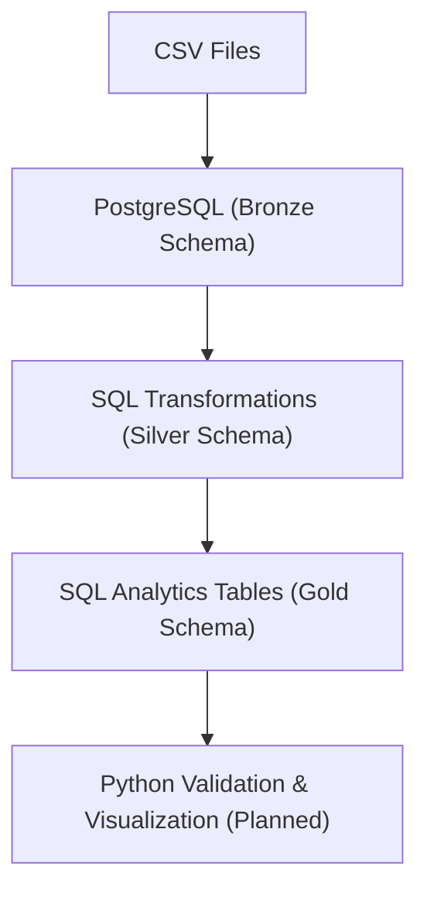

# 🛒 E-commerce Analytics Data Warehouse (PostgreSQL)

This project demonstrates an end-to-end analytics engineering workflow using a relational database and SQL-first transformations.
The pipeline follows a Bronze → Silver → Gold architecture with Python used for ingestion and orchestration.

### 🧱 Architecture Overview

### 🟤 Bronze Layer — Raw Data Ingestion

**Objective:**

Land raw source data into PostgreSQL with minimal transformation.

**Details:**

* Source data consists of e-commerce CSV files (customers, products, orders, order_items).

* Raw CSV files are stored in the data/raw/ directory.

* PostgreSQL database (ecommerce_dw) is used as the warehouse.

* Separate schemas were created for each layer:

    * bronze

    * silver

    * gold

**Ingestion approach:**

* Tables were created in the bronze schema.

* Data was loaded using Python with pandas and SQLAlchemy.

* Database credentials are managed securely using environment variables (.env).

**Key principle:**

* Bronze tables represent a landing zone and are treated as immutable.

* No business logic or filtering is applied at this stage.

### 🥈 Silver Layer — Data Cleaning & Modeling (SQL)

**Objective:**

Prepare analytics-ready tables by enforcing data quality and business rules.

**Transformations applied:**

* Removed duplicate records using SELECT DISTINCT.

* Filtered orders to include only delivered orders.

* Standardized date fields for consistent time-based analysis.

* Enforced referential integrity:

    * Dropped orphan order_items records using joins against valid orders.

* Handled key consistency issues by applying TRIM() on join columns to prevent false mismatches.

**Silver tables created:**

    * silver.customers

    * silver.products

    * silver.orders

    * silver.order_items

**Key principle:**

* Silver layer enforces business correctness, not just null handling.

* All transformations are implemented using pure SQL.

### 🟡 Gold Layer — Analytical Metrics (SQL)

**Objective:**

Create business-ready, aggregated tables for reporting and analysis.

**Gold metrics implemented:**

* **Monthly Revenue Metrics**

    * Total revenue

    * Total orders

* **City-Level Monthly Metrics**

    * Active users

    * Revenue

    * Order volume

* **Category-Level Monthly Revenue**

    * Revenue and order trends by product category

* **Customer Lifetime Value (CLV)**

    * Total revenue per customer

    * Order count

    * First and last purchase dates

Gold objects are created as tables/views under the *gold* schema and are designed to be directly consumable by BI tools.

### 📈 Python Validation & Visualization (Planned)

**Next steps (in progress):**

    * Query Gold tables using Python.

    * Perform sanity checks on aggregates (row counts, revenue totals).

    * Create simple validation plots (monthly revenue trends, top categories).

    * Export selected Gold tables for downstream consumption.

### 🛠 Tech Stack

Database: PostgreSQL

* Languages: SQL, Python

* Python Libraries: pandas, SQLAlchemy

* Architecture: Bronze–Silver–Gold (Medallion Architecture)

* Version Control: Git & GitHub

* Security: Environment variable–based credential management

### 📌 Key Learnings

* Designed a SQL-first analytics warehouse with layered architecture.

* Applied real-world data modeling concepts (facts, dimensions, grain).

* Enforced data quality using joins and business rules.

* Demonstrated how Python complements SQL as an orchestration tool.

* Built analytics-ready datasets suitable for reporting and dashboards.